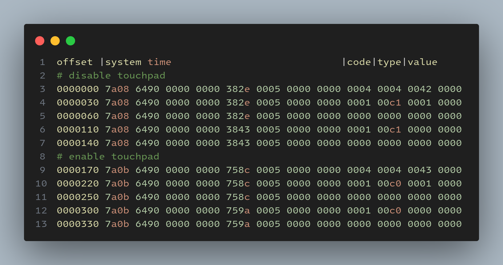

# Linux Tablet Mode Controller

This service detects when the laptop is in tablet or laptop mode and changes display settings accordingly.

This has only been tested and proven working on a Lenovo Ideapad Flex 5 with Linux Mint installed.

Help is welcome to improve the compatibility with other devices and to improve the setup.

## Setup

Install the debian package, then run the service as the user:

```bash
systemctl --user daemon-reload
systemctl --user start tablet-mode.service
systemctl --user enable tablet-mode.service
```

## How it works

I went through the events in `/dev/input`, running `cat inputX | od -x --width=24` and folding the screen back and forth until one produced an output at the time of folding to tablet mode and folding it back.

Below was the output of `event10`:



The output was consitent to this format, so I wrote the code to watch the output for the 0x42 and 0x43 values to determine which state it should be in.
When it detects the laptop to be in tablet mode, it runs the following command to turn off screen orientation lock:

```bash
gsettings set org.cinnamon.settings-daemon.peripherals.touchscreen orientation-lock false
```

When it detects the laptop lid is opened, it runs the following 2 commands to enable screen orientation lock and to set the screen orientation to normal:

```bash
gsettings set org.cinnamon.settings-daemon.peripherals.touchscreen orientation-lock true
xrandr -o normal
```
